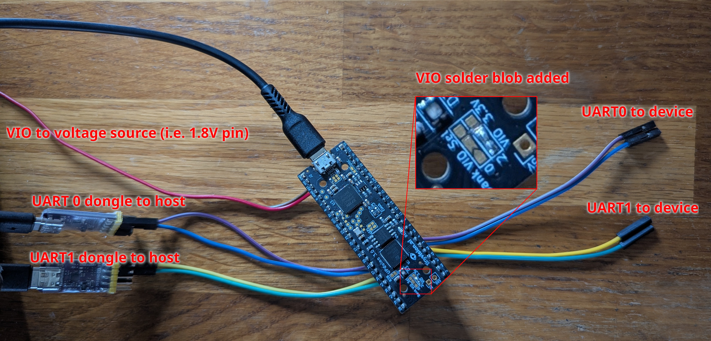

# Upduino Level Shifter

Use an Upduino v3.0 to implement a level shifter for use with various TX/RX based protocols such as UART.



The full pinout is as below:

```
               PCF   Pin# _______ Pin#  PCF
                    ------| USB |------
 to VIO       <GND> |  1   \___/   48 | spi_ssn
 source +-----<VIO> |  2           47 | spi_sck
voltage       <RST> |  3           46 | spi_mosi
             <DONE> |  4           45 | spi_miso
            led_red |  5           44 | gpio_20
          led_green |  6     U     43 | gpio_10
           led_blue |  7     P     42 | <GND>
              <+5V> |  8     D     41 | <12 MHz>
            <+3.3V> |  9     U     40 | gpio_12
              <GND> | 10     I     39 | gpio_21
            gpio_23 | 11     N     38 | gpio_13
            gpio_25 | 12     O     37 | gpio_19
            gpio_26 | 13           36 | gpio_18
            gpio_27 | 14     V     35 | gpio_11
            gpio_32 | 15     3     34 | gpio_9
            gpio_35 | 16     .     33 | gpio_6
            gpio_31 | 17     0     32 | gpio_44   
        ==> gpio_37 | 18           31 | gpio_4  ==>
        <== gpio_34 | 19           30 | gpio_3  <==
  3V3   ==> gpio_43 | 20           29 | gpio_48 ==>   VIO
voltage <== gpio_36 | 21           28 | gpio_45 <== voltage
 level  ==> gpio_42 | 22           27 | gpio_47 ==>  level
        <== gpio_38 | 23           26 | gpio_46 <==
        ==> gpio_28 | 24           25 | gpio_2  ==>
                    -------------------

```

The 3V3 voltage side can be connected to the dongle.

The VIO voltage side can be connected to the device to access.

The VIO pin needs to be connected to the voltage rail to use for I/O.
Typically some voltage pin from the device under test.

This project assumes [OSS CAD Suite](https://github.com/YosysHQ/oss-cad-suite-build) is installed,
and you may set the `export OSS_CAD_SUITE=path/to/your/oss-cad-suite` environment variable, or override
each of the individual tools, or modify the Makefile.

To build:


```
make
make flash
```
